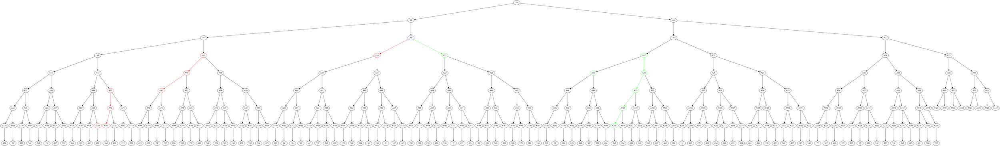

# 标题：下面是一代码 graphviz 代码，表示一幅图，帮助理解线段树
可以把下面代码粘贴到 https://sketchviz.com/new 中显示出来。主要用于查询 `139` 节点到 `200` 节点之间的值。具体范围为 `[139, 200)`

```dot
# http://www.graphviz.org/content/cluster

digraph G {
  graph [fontname = "Handlee"];
  node [fontname = "Handlee", ordering=out];
  edge [fontname = "Handlee"];
  ranksep = 1.5;
  nodesep = 0.05;
  subgraph ccluster_layer1 {
      nodesep=10;
      A2,A3
      }
  subgraph ccluster_layer2 {
      A4,A5,A6,A7
      }
  subgraph ccluster_layer3 {
      
      {rank=same;A8,A9,A10,A11,A12,A13,A14,A15}
      }
  subgraph ccluster_layer4 {
      rank=same;
      A16,A17,A18,A19,A20,A21,A22,A23,A24,A25,A26,A27,A28,A29,A30,A31
      }
  subgraph ccluster_layer5 {
      rank=same;
      A32,A33,A34,A35,A36,A37,A38,A39,A40,A41,A42,A43,A44,A45,A46,A47,A48,A49,A50,A51,A52,A53,A54,A55,A56,A57,A58,A59,A60,A61,A62,A63
      }
  subgraph ccluster_layer6 {
      rank=same;
      A64,A65,A66,A67,A68,A69,A70,A71,A72,A73,A74,A75,A76,A77,A78,A79,A80,A81,A82,A83,A84,A85,A86,A87,A88,A89,A90,A91,A92,A93,A94,A95,A96,A97,A98,A99,A100,A101,A102,A103,A104,A105,A106,A107,A108,A109,A110,A111,A112,A113,A114,A115,A116,A117,A118,A119,A120,A121,A122,A123,A124,A125,A126,A127
      }
  subgraph ccluster_layer7 {
      rank=same;
      A128,A129,A130,A131,A132,A133,A134,A135,A136,A137,A138,A139,A140,A141,A142,A143,A144,A145,A146,A147,A148,A149,A150,A151,A152,A153,A154,A155,A156,A157,A158,A159,A160,A161,A162,A163,A164,A165,A166,A167,A168,A169,A170,A171,A172,A173,A174,A175,A176,A177,A178,A179,A180,A181,A182,A183,A184,A185,A186,A187,A188,A189,A190,A191,A192,A193,A194,A195,A196,A197,A198,A199,A200,A201,A202,A203,A204,A205,A206,A207,A208,A209,A210,A211,A212,A213,A214,A215,A216,A217,A218,A219,A220,A221,A222,A223,A224,A225,A226,A227,A228,A229,A230,A231,A232,A233,A234,A235,A236,A237,A238
      }
  subgraph ccluster_layer8 {
      rank=same;
      L128,L129,L130,L131,L132,L133,L134,L135,L136,L137,L138,L139,L140,L141,L142,L143,L144,L145,L146,L147,L148,L149,L150,L151,L152,L153,L154,L155,L156,L157,L158,L159,L160,L161,L162,L163,L164,L165,L166,L167,L168,L169,L170,L171,L172,L173,L174,L175,L176,L177,L178,L179,L180,L181,L182,L183,L184,L185,L186,L187,L188,L189,L190,L191,L192,L193,L194,L195,L196,L197,L198,L199,L200,L201,L202,L203,L204,L205,L206,L207,L208,L209,L210,L211,L212,L213,L214,L215,L216,L217,L218,L219,L220,L221,L222,L223,L224,L225,L226,L227,L228,L229,L230,L231,L232,L233,L234,L235,L236,L237,L238
      }
  A5[color=blue;];
  A10[color=red;]; 
A9[color=red;]; A11[color=green;];
A18[color=red;]; A12[color=green;];
A36[color=red;];  A24[color=green;];A25[color=green;];
A35[color=red;];  A50[color=green;];
A70[color=red;];  A100[color=green;];
A139[color=red;]; A200[color=green;];
A140[color=red;];
L128[label=486];
L129[label=75];
L130[label=402];
L131[label=142];
L132[label=254];
L133[label=15];
L134[label=427];
L135[label=157];
L136[label=366];
L137[label=353];
L138[label=402];
L139[label=497];
L140[label=364];
L141[label=406];
L142[label=211];
L143[label=119];
L144[label=419];
L145[label=110];
L146[label=78];
L147[label=131];
L148[label=204];
L149[label=203];
L150[label=118];
L151[label=348];
L152[label=128];
L153[label=129];
L154[label=103];
L155[label=138];
L156[label=213];
L157[label=290];
L158[label=154];
L159[label=429];
L160[label=302];
L161[label=24];
L162[label=98];
L163[label=50];
L164[label=47];
L165[label=139];
L166[label=296];
L167[label=478];
L168[label=172];
L169[label=128];
L170[label=284];
L171[label=36];
L172[label=136];
L173[label=31];
L174[label=107];
L175[label=42];
L176[label=393];
L177[label=109];
L178[label=218];
L179[label=430];
L180[label=196];
L181[label=7];
L182[label=413];
L183[label=23];
L184[label=80];
L185[label=235];
L186[label=143];
L187[label=388];
L188[label=372];
L189[label=179];
L190[label=183];
L191[label=236];
L192[label=350];
L193[label=19];
L194[label=196];
L195[label=245];
L196[label=248];
L197[label=63];
L198[label=306];
L199[label=484];
L200[label=268];
L201[label=334];
L202[label=333];
L203[label=373];
L204[label=261];
L205[label=497];
L206[label=480];
L207[label=133];
L208[label=9];
L209[label=213];
L210[label=270];
L211[label=275];
L212[label=454];
L213[label=168];
L214[label=491];
L215[label=434];
L216[label=424];
L217[label=446];
L218[label=130];
L219[label=421];
L220[label=147];
L221[label=407];
L222[label=381];
L223[label=140];
L224[label=77];
L225[label=327];
L226[label=467];
L227[label=122];
L228[label=337];
L229[label=97];
L230[label=235];
L231[label=132];
L232[label=421];
L233[label=156];
L234[label=168];
L235[label=225];
L236[label=20];
L237[label=184];
L238[label=292];
A1 -> A2;
A1 -> A3;
A2 -> A4;
A2 -> A5;
A3 -> A6;
A3 -> A7;
A4 -> A8;
A4 -> A9;
A5 -> A10[color=red];
A5 -> A11[color=green;];
A6 -> A12;
A6 -> A13;
A7 -> A14;
A7 -> A15;
A8 -> A16;
A8 -> A17;
A9 -> A18[color=red;];
A9 -> A19;

A10 -> A20;
A10 -> A21;

A11 -> A22;
A11 -> A23;
A12 -> A24;
A12 -> A25[color=green;];
A13 -> A26;
A13 -> A27;
A14 -> A28;
A14 -> A29;
A15 -> A30;
A15 -> A31;
A16 -> A32;
A16 -> A33;
A17 -> A34;
A17 -> A35;
A18 -> A36[color=red;];
A18 -> A37;

A19 -> A38;
A19 -> A39;
A20 -> A40;
A20 -> A41;
A21 -> A42;
A21 -> A43;
A22 -> A44;
A22 -> A45;
A23 -> A46;
A23 -> A47;
A24 -> A48;
A24 -> A49;
A25 -> A50[color=green;];
A25 -> A51;
A26 -> A52;
A26 -> A53;
A27 -> A54;
A27 -> A55;
A28 -> A56;
A28 -> A57;
A29 -> A58;
A29 -> A59;
A30 -> A60;
A30 -> A61;
A31 -> A62;
A31 -> A63;
A32 -> A64;
A32 -> A65;
A33 -> A66;
A33 -> A67;
A34 -> A68;
A34 -> A69;
A35 -> A70[color=red;];
A35 -> A71;

A36 -> A72;
A36 -> A73;

A37 -> A74;
A37 -> A75;
A38 -> A76;
A38 -> A77;
A39 -> A78;
A39 -> A79;
A40 -> A80;
A40 -> A81;
A41 -> A82;
A41 -> A83;
A42 -> A84;
A42 -> A85;
A43 -> A86;
A43 -> A87;
A44 -> A88;
A44 -> A89;
A45 -> A90;
A45 -> A91;
A46 -> A92;
A46 -> A93;
A47 -> A94;
A47 -> A95;
A48 -> A96;
A48 -> A97;
A49 -> A98;
A49 -> A99;
A50 -> A100[color=green;];
A50 -> A101;
A51 -> A102;
A51 -> A103;
A52 -> A104;
A52 -> A105;
A53 -> A106;
A53 -> A107;
A54 -> A108;
A54 -> A109;
A55 -> A110;
A55 -> A111;
A56 -> A112;
A56 -> A113;
A57 -> A114;
A57 -> A115;
A58 -> A116;
A58 -> A117;
A59 -> A118;
A59 -> A119;
A60 -> A120;
A60 -> A121;
A61 -> A122;
A61 -> A123;
A62 -> A124;
A62 -> A125;
A63 -> A126;
A63 -> A127;
A64 -> A128;
A64 -> A129;
A65 -> A130;
A65 -> A131;
A66 -> A132;
A66 -> A133;
A67 -> A134;
A67 -> A135;
A68 -> A136;
A68 -> A137;
A69 -> A138;
A69 -> A139;

A70 -> A140[color=red;];
A70 -> A141;
A71 -> A142;
A71 -> A143;
A72 -> A144;
A72 -> A145;
A73 -> A146;
A73 -> A147;
A74 -> A148;
A74 -> A149;
A75 -> A150;
A75 -> A151;
A76 -> A152;
A76 -> A153;
A77 -> A154;
A77 -> A155;
A78 -> A156;
A78 -> A157;
A79 -> A158;
A79 -> A159;
A80 -> A160;
A80 -> A161;
A81 -> A162;
A81 -> A163;
A82 -> A164;
A82 -> A165;
A83 -> A166;
A83 -> A167;
A84 -> A168;
A84 -> A169;
A85 -> A170;
A85 -> A171;
A86 -> A172;
A86 -> A173;
A87 -> A174;
A87 -> A175;
A88 -> A176;
A88 -> A177;
A89 -> A178;
A89 -> A179;
A90 -> A180;
A90 -> A181;
A91 -> A182;
A91 -> A183;
A92 -> A184;
A92 -> A185;
A93 -> A186;
A93 -> A187;
A94 -> A188;
A94 -> A189;
A95 -> A190;
A95 -> A191;
A96 -> A192;
A96 -> A193;
A97 -> A194;
A97 -> A195;
A98 -> A196;
A98 -> A197;
A99 -> A198;
A99 -> A199;
A100 -> A200[color=green;];
A100 -> A201;
A101 -> A202;
A101 -> A203;
A102 -> A204;
A102 -> A205;
A103 -> A206;
A103 -> A207;
A104 -> A208;
A104 -> A209;
A105 -> A210;
A105 -> A211;
A106 -> A212;
A106 -> A213;
A107 -> A214;
A107 -> A215;
A108 -> A216;
A108 -> A217;
A109 -> A218;
A109 -> A219;
A110 -> A220;
A110 -> A221;
A111 -> A222;
A111 -> A223;
A112 -> A224;
A112 -> A225;
A113 -> A226;
A113 -> A227;
A114 -> A228;
A114 -> A229;
A115 -> A230;
A115 -> A231;
A116 -> A232;
A116 -> A233;
A117 -> A234;
A117 -> A235;
A118 -> A236;
A118 -> A237;
A119 -> A238;
A128 -> L128;
A129 -> L129;
A130 -> L130;
A131 -> L131;
A132 -> L132;
A133 -> L133;
A134 -> L134;
A135 -> L135;
A136 -> L136;
A137 -> L137;
A138 -> L138;
A139 -> L139;

A140 -> L140;

A141 -> L141;
A142 -> L142;
A143 -> L143;
A144 -> L144;
A145 -> L145;
A146 -> L146;
A147 -> L147;
A148 -> L148;
A149 -> L149;
A150 -> L150;
A151 -> L151;
A152 -> L152;
A153 -> L153;
A154 -> L154;
A155 -> L155;
A156 -> L156;
A157 -> L157;
A158 -> L158;
A159 -> L159;
A160 -> L160;
A161 -> L161;
A162 -> L162;
A163 -> L163;
A164 -> L164;
A165 -> L165;
A166 -> L166;
A167 -> L167;
A168 -> L168;
A169 -> L169;
A170 -> L170;
A171 -> L171;
A172 -> L172;
A173 -> L173;
A174 -> L174;
A175 -> L175;
A176 -> L176;
A177 -> L177;
A178 -> L178;
A179 -> L179;
A180 -> L180;
A181 -> L181;
A182 -> L182;
A183 -> L183;
A184 -> L184;
A185 -> L185;
A186 -> L186;
A187 -> L187;
A188 -> L188;
A189 -> L189;
A190 -> L190;
A191 -> L191;
A192 -> L192;
A193 -> L193;
A194 -> L194;
A195 -> L195;
A196 -> L196;
A197 -> L197;
A198 -> L198;
A199 -> L199;
A200 -> L200;
A201 -> L201;
A202 -> L202;
A203 -> L203;
A204 -> L204;
A205 -> L205;
A206 -> L206;
A207 -> L207;
A208 -> L208;
A209 -> L209;
A210 -> L210;
A211 -> L211;
A212 -> L212;
A213 -> L213;
A214 -> L214;
A215 -> L215;
A216 -> L216;
A217 -> L217;
A218 -> L218;
A219 -> L219;
A220 -> L220;
A221 -> L221;
A222 -> L222;
A223 -> L223;
A224 -> L224;
A225 -> L225;
A226 -> L226;
A227 -> L227;
A228 -> L228;
A229 -> L229;
A230 -> L230;
A231 -> L231;
A232 -> L232;
A233 -> L233;
A234 -> L234;
A235 -> L235;
A236 -> L236;
A237 -> L237;
A238 -> L238;
}
```
