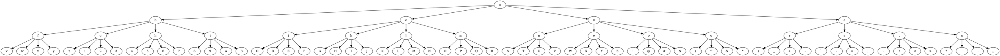

# 四叉树用graphviz画出来，不同的样式如下
1. dot

2. 

# 源码

```dot
digraph G {
a->{b,c,d,e}
b->{f,g,h,i}
c->{j,k,l,m}
d->{n,o,p,q}
e->{r,s,t,u}
f->{v,w,x,y}
g->{z,1,2,3}
h->{4,5,6,7}
i->{8,9,A,B}
j->{C,D,E,F}
k->{G,H,I,J}
l->{K,L,M,N}
m->{O,P,Q,R}
n->{S,T,U,V}
o->{W,X,Y,Z}
p->{"!", "@", "#", "$"}
q->{"(","^","&","*"}
r->{")","_","+","~"}
s->{"`","-","=",","}
t->{".","/","<",">"}
u->{"?"," ","..",",,"}
}
```
